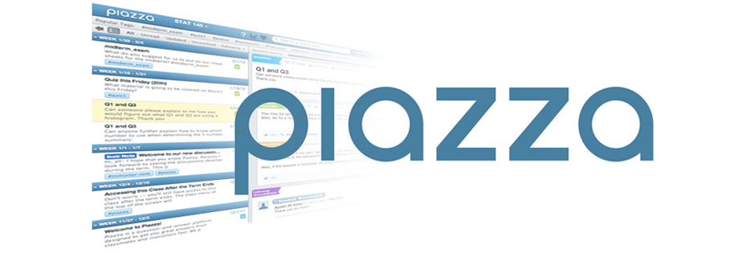

```{r packages, message = FALSE, warning = FALSE, echo=FALSE}

```


```{r Setup, include=FALSE, results='hide', warning=FALSE}

# A Prefix nulling hook.

# Make sure to keep the default for normal processing.
default_output_hook <- knitr::knit_hooks$get("output")

# Output hooks handle normal R console output.
knitr::knit_hooks$set( output = function(x, options) {

  comment <- knitr::opts_current$get("comment")
  if( is.na(comment) ) comment <- ""
  can_null <- grepl( paste0( comment, "\\s*\\[\\d?\\]" ),
                     x, perl = TRUE)
  do_null <- isTRUE( knitr::opts_current$get("null_prefix") )
  if( can_null && do_null ) {
    # By default R print output aligns at the right brace.
    align_index <- regexpr( "\\]", x )[1] - 1
    # Two cases: start or newline
    re <- paste0( "^.{", align_index, "}\\]")
    rep <- comment
    x <- gsub( re, rep,  x )
    re <- paste0( "\\\n.{", align_index, "}\\]")
    rep <- paste0( "\n", comment )
    x <- gsub( re, rep,  x )
  }

  default_output_hook( x, options )

})

knitr::opts_template$set("kill_prefix"=list(comment=NA, null_prefix=TRUE))


## Normal Setup From Here
library(knitr)

opts_chunk$set(fig.path="images/",
               cache.path="cache/",
               cache=TRUE,
               echo=TRUE,
               message=FALSE,
               warning=FALSE)
```

## Link to the course material

http://bit.ly/qmssmds

## Who am I

Thomas Brambor

Email: thomas.brambor@columbia.edu

Office hours: Mondays 5 - 6pm and by appointment. 

Location: IAB 509E 

## Your TAs

TA1: Xinyu Ni  
[xn2115@tc.columbia.edu](xn2115@tc.columbia.edu)  
IAB 270 Time TBA

TA2: Mikaela Zhang  
[xz2782@columbia.edu](xz2782@columbia.edu)  
IAB 270 Time Wed 10am - 12pm

## Who are you?

>- Background / Discipline: Economics, History, Political Science, Psychology, Sociology, CS, Statistics, Other?
>- in QMSS / other program?
>- Just off the boat, or here second year?
>- used R before this course? Before QMSS?
>- used other programming language(s) before, e.g. Python, SAS, MATLAB, SQL, Java etc.?
>- used R Markdown?
>- used GitHub?
>- used a web API before? web scraping?

# The Data in Data Science 

```{r, echo=FALSE, out.width = "105%"}
knitr::include_graphics("images/data_binary.jpg")
```


## 
<span style="font-weight:bold; font-size:230%;">
Water, water, everywhere,  
nor any drop to drink.  
</span>

      in The Rime of the Ancient Mariner, by Samuel Taylor Coleridge

## 
<span style="font-weight:bold; font-size:230%;">
Data, Data, everywhere,    
nor any thought to think.  
</span>

      random dude on twitter
      
## Data Wrangling

```{r, echo=FALSE, out.width = "100%"}
knitr::include_graphics("images/filing-cabinet.jpg")
```

## Analytical Process

```{r, echo=FALSE, out.width = "90%"}
knitr::include_graphics("images/Wickham_tidyverse1.png")
```


## Analytical Process

```{r, echo=FALSE, out.width = "90%"}
knitr::include_graphics("images/Wickham_tidyverse2.png")
```

## Analytical Process

```{r, echo=FALSE, out.width = "90%"}
knitr::include_graphics("images/Wickham_tidyverse3.png")
```

## Data Wrangling

```{r, echo=FALSE, out.width = "100%"}
knitr::include_graphics("images/data_wrangling_horses.jpeg")
```


# Course Outline

## Subparts of the course

- Part 1 - Data Manipulation
- Part 2 - Getting Data In
- Part 3 - Some big data considerations

# Part 1 - Data Manipulation

## Git and Github. Why?

* Git
    - version control is good (for many reasons)
    - master-branch workflow
    - distributed (rather than centralized) version control
    - pull requests to manage/discuss updates
    - de facto standard on version control

* GitHub
    - Github is like facebook for programmers. Everyone is on there. 
    - open source
    - lowers the barriers to collaboration

## Basics of the `tidyverse`

```{r, echo=FALSE, out.width = "90%"}
knitr::include_graphics("images/Wickham_tidyverse1.png")
```

## 

<span style="font-weight:bold; font-size:230%;">
No matter how complex and polished the individual operations are, it is often the quality of the glue that most directly determines the power of the system.
</span>
— Hal Abelson   

## Basics of the `tidyverse`

```{r, echo=FALSE, out.width = "90%"}
knitr::include_graphics("images/Wickham_tidyverse_withcommands.png")
```

## Basics of the `tidyverse`

**Import**:  
  - `readr`: import different kinds of rectangular data (e.g. csv, tsc, fwf) in a fast and friendly way; `readxl` and `xml2` for special types
  
**Tidy**:  
  - `tidyr`: reshape the layout of dataframes into a specific type, the `tibble` -- a _tidy_ data frame

## Basics of the `tidyverse`

**Transform**:   
  - `dplyr` provides function to manipulate and transform data frames.  
  - Includes select, filter, group, summarize, arrange, mutate, join etc. 

**Data Types**:  
  - How to work with the different types of data such as numerics, characters (`stringr`), factors (`forcats`), and dates (`lubridate`)

## What we won't cover in the `tidyverse`

- visualization (`ggplot2`) 
- communciation (`broom`)

## Functions and Functional Programming

```{r, echo=FALSE, out.width = "90%"}
knitr::include_graphics("images/magrittr_pipe.png")
```

## Functions and Functional Programming

- `dplyr` imports the `%>%` operator from the `magrittr` package. - `x %>% f(y)` is equivalent to `f(x, y)`. 
- Easy to combine multiple operations into a readable chain of commands.

## Functions and Functional Programming

```{r, echo=FALSE, out.width = "50%"}
knitr::include_graphics("images/keepcalm_dontcopy.jpg")
```

## Functions and Functional Programming

- avoid repetitive code by using functions
- functional programming:
    - Functions of functions
    - Anonymous functions
    - List of functions
    - Function operators

## Free Expressions and Strings

- strings usually contain unstructured or semi-structured data
- handling and processing strings with `stringr`
- using regular expressions - a concise language for describing patterns in strings. 

```{r, echo=FALSE, out.width = "100%"}
knitr::include_graphics("images/emailregex.jpg")
```

## Regular Expressions

```{r, echo=FALSE, out.width = "90%"}
knitr::include_graphics("images/cat-like-typing-detected.gif")
```

# Part 2 - Getting Data In

## Getting Data In

```{r, echo=FALSE, out.width = "70%"}
knitr::include_graphics("images/automated_data_collection.png")
```

## Getting Data In

- importing data from a single file on disk (or stored online) is only one way of getting data
- we will explore other types of data

## APIs

Using the `httr` package (a wrapper for `curl`) to access some well-known web APIs

```{r, echo=FALSE, out.width = "100%"}
knitr::include_graphics("images/nytimes_api.png")
```

## Handling JSON and XML

- APIs usually return data in JSON or XML format as exchange format
- We will learn how to deal with these formats in R and transform them into rectangular data formats.

```{r, echo=FALSE, out.width = "100%"}
knitr::include_graphics("images/xml_json.svg")
```

## Screen Scraping from HTML

- Screen scraping refers to a type of computer program that:
    - reads in a web page  
    - finds some information on it
    - grabs the information
    - stores it in a data set
    
- But HTML is messy. Will need to select the right elements and clean it up.

- Old school way of getting information. Many websites do not allow it anymore (TOS) and/or make it difficult.

## Relational Databases

- databases consisting of multiple tables of data are called **relational data** because it is the relations, not just the individual data sets, that are important.  
- **SQL** allows to interact with such databases to modify, insert, remove, or request data  
- we can use R to interact with SQL databases directly

```{r, echo=FALSE, out.width = "70%"}
knitr::include_graphics("images/reldata_movies.gif")
```

# Part 3 - Other Big Data Considerations

## 

<span style="font-weight:bold; font-size:230%;">
We have big data when the computing time for the calculation takes longer than the cognitive process of designing a model.
</span>

## What is big data?

```{r, echo=FALSE, out.width = "80%"}
knitr::include_graphics("images/bigdata_3Vs.png")
```

## What do we need to know?

- computing power becomes a real constraint
- **efficiency** and **structure** matters (more)

- Can we use R to analyze big data?
    - bigger hardware
    - piece wise analysis
    - sampling
    - parallelization (e.g. Amazon Web Services)
    - higher performing programming languages like C++ or Java

# Some Administrative Things

## Lectures

- Mondays 6.10 - 8pm
- Don’t be late (it disrupts class and concentration). 
- Bring a laptop if available. 
(*but check your facebook at home).

```{r, echo=FALSE, out.width = "60%"}
knitr::include_graphics("images/desktop_computer_at_starbucks.jpg")
```

## Books & Readings

- No required text book. Yay!
- Several recommended books. Chapters assigned as needed.

```{r, echo=FALSE, out.width = "25%"}
knitr::include_graphics("images/bookcover_WickhamGrolemund.png")
knitr::include_graphics("images/bookcover_WickhamAdvR.jpg")
knitr::include_graphics("images/bookcover_Boehmke.jpg")
```

## Datacamp

```{r, echo=FALSE, out.width = "100%"}
knitr::include_graphics("images/datacamp_logo.png")
```


## Taking Notes

- in class there will be a lot of back and forth between general explanatory material, bits of code, comments to ourselves, and other stuff

- My suggestion: take notes in RStudio using R Markdown notebooks or a simple R Markdown file

- For your assignments, this is also a good option. 

- More info here: http://rmarkdown.rstudio.com/

## Why R Markdown?

PRO:

- Reproducible. For others and your later (forgetful) self.

- Live document. Combining code and output. Changes to your data or code will immediately update.

- supports numerous static and dynamic output formats including HTML, PDF, MS Word, Beamer, slides, shiny applications

CON: 

- Typesetting not as detailed as Latex [R Markdown is designed for HTML, Latex for PDFs]

## R Studio - Let’s do a quick intro

- Create a new project. 
- Create a new notebook file.

<br><br>

- For later: make some folders (Lectures / Exercises / Final Project etc.) to keep order.
- If unfamiliar with R Markdown, work through http://rmarkdown.rstudio.com/ or similar tutorials to get going. 

## Course Website

- Piazza course site for discussion forum and announcements. Make sure to set your notification settings right.

- All lectures slides, in-class exercises, homework, code etc. will be made available here: https://github.com/QMSS-G5072-2018/

- All homework submitted via Github. Introduction to GitHub next week.

## Github

Next week, our github course site will turn into a private repository. Please sign up here to be part of the club.

http://bit.ly/githubmds

## Piazza

Please also add yourself to our piazza course forum here:

http://bit.ly/piazzamds

```{r, echo=FALSE, out.width = "100%"}

```

## Assignments 

- Final exam/project (30%)

- Assignments (60%): short weekly individual assignments.

- Participation & Attendance (10%)

## Is this the right class for me?

```{r, echo=FALSE, out.width = "100%"}
knitr::include_graphics("images/data_pre90percent.jpeg")
```

## Getting a DS job

```{r, echo=FALSE, out.width = "80%"}
knitr::include_graphics("images/job_interview_ikea.jpg")
```


## Should I take this class?

```{r, echo=FALSE, out.width = "65%"}
knitr::include_graphics("images/coders.png")
```
