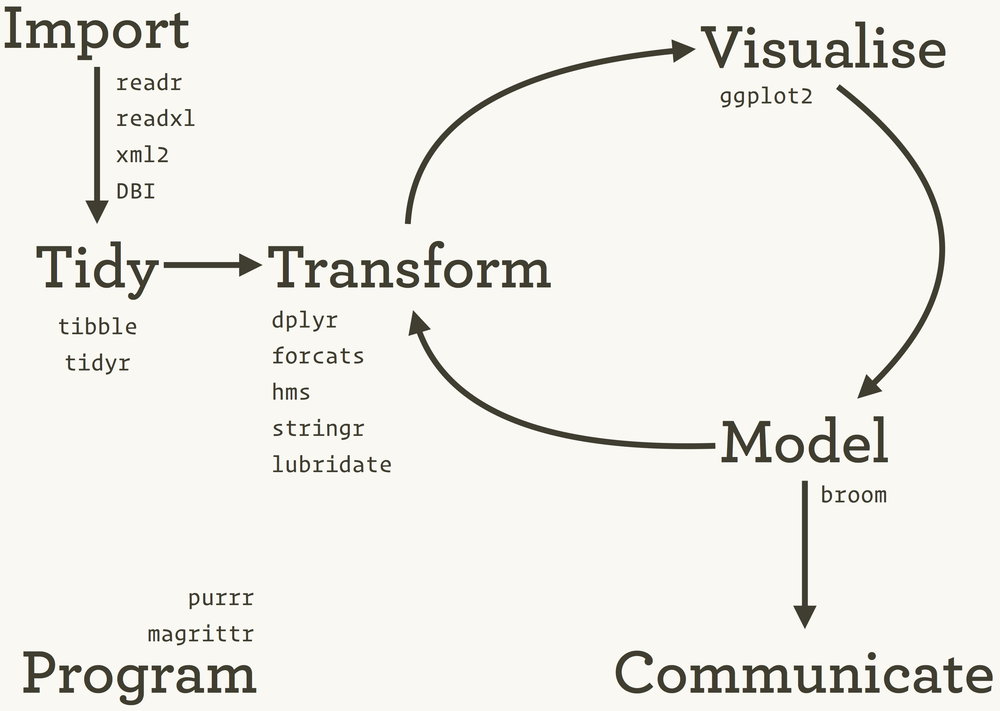
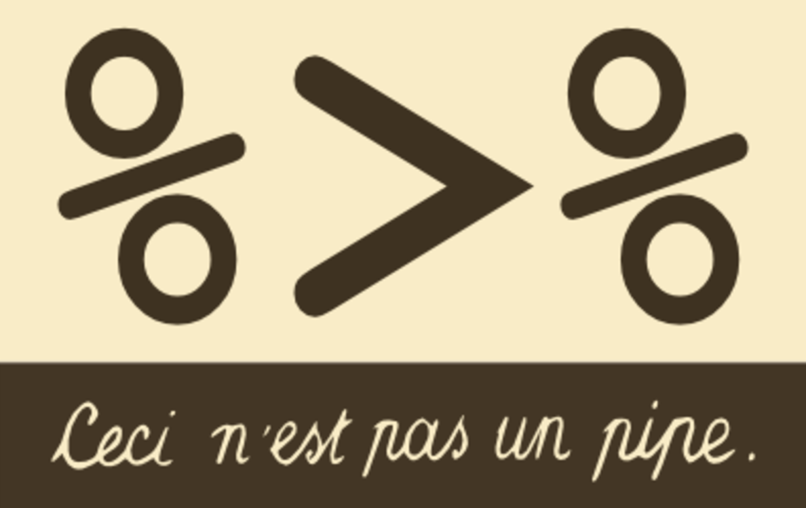
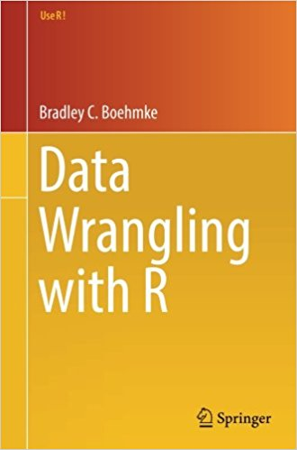

Week 1 - Introduction to the Course
================
Thomas Brambor
September 6, 2017

-   [Who am I](#who-am-i)
-   [Your TAs](#your-tas)
-   [Who are you?](#who-are-you)
-   [The Data in Data Science](#the-data-in-data-science)
    -   
    -   
    -   [Data Wrangling](#data-wrangling)
    -   [Analytical Process](#analytical-process)
    -   [Analytical Process](#analytical-process-1)
    -   [Analytical Process](#analytical-process-2)
    -   [Data Wrangling](#data-wrangling-1)
-   [Course Outline](#course-outline)
    -   [Subparts of the course](#subparts-of-the-course)
-   [Part 1 - Data Manipulation](#part-1---data-manipulation)
    -   [Git and Github. Why?](#git-and-github.-why)
    -   [Basics of the `tidyverse`](#basics-of-the-tidyverse)
    -   
    -   [Basics of the `tidyverse`](#basics-of-the-tidyverse-1)
    -   [Basics of the `tidyverse`](#basics-of-the-tidyverse-2)
    -   [Basics of the `tidyverse`](#basics-of-the-tidyverse-3)
    -   [What we won't cover in the `tidyverse`](#what-we-wont-cover-in-the-tidyverse)
    -   [Functions and Functional Programming](#functions-and-functional-programming)
    -   [Functions and Functional Programming](#functions-and-functional-programming-1)
    -   [Functions and Functional Programming](#functions-and-functional-programming-2)
    -   [Functions and Functional Programming](#functions-and-functional-programming-3)
    -   [Free Expressions and Strings](#free-expressions-and-strings)
    -   [Regular Expressions](#regular-expressions)
-   [Part 2 - Getting Data In](#part-2---getting-data-in)
    -   [Getting Data In](#getting-data-in)
    -   [Getting Data In](#getting-data-in-1)
    -   [APIs](#apis)
    -   [Handling JSON and XML](#handling-json-and-xml)
    -   [Screen Scraping from HTML](#screen-scraping-from-html)
    -   [Relational Databases](#relational-databases)
-   [Part 3 - Other Big Data Considerations](#part-3---other-big-data-considerations)
    -   
    -   [What is big data?](#what-is-big-data)
    -   [What do we need to know?](#what-do-we-need-to-know)
-   [Some Administrative Things](#some-administrative-things)
    -   [Lectures](#lectures)
    -   [Books & Readings](#books-readings)
    -   [Taking Notes](#taking-notes)
    -   [Why R Markdown?](#why-r-markdown)
    -   [R Studio - Let’s do a quick intro](#r-studio---lets-do-a-quick-intro)
    -   [Course Website](#course-website)
    -   [Assignments](#assignments)
    -   [Is this the right class for me?](#is-this-the-right-class-for-me)
    -   [Should I take this class?](#should-i-take-this-class)

Who am I
--------

Thomas Brambor

Email: <tb2729@columbia.edu>

Office hours: Thursdays 10.30-11.30am and by appointment.

Location: IAB 509E

Your TAs
--------

Shriya Balaji Palsamudram
[sbp2148@columbia.edu](sbp2148@columbia.edu)
IAB 270 Time TBA

Sahil Manocha
[sahil.manocha@columbia.edu](sahil.manocha@columbia.edu)
IAB 270 Time TBA

Who are you?
------------

> -   Background / Discipline: Economics, History, Political Science, Psychology, Sociology, CS, Statistics, Other?
> -   in QMSS / other program?
> -   Just off the boat, or here second year?
> -   used R before this course? Before QMSS?
> -   used other programming language(s) before, e.g. Python, SAS, MATLAB, SQL, Java etc.?
> -   used R Markdown?
> -   used GitHub?
> -   used a web API before? web scraping?

The Data in Data Science
========================

 Water, water, everywhere,
nor any drop to drink.

      in The Rime of the Ancient Mariner, by Samuel Taylor Coleridge

 Data, Data, everywhere,
nor any thought to think.

      random dude on twitter
      

Data Wrangling
--------------

Analytical Process
------------------

Analytical Process
------------------

Analytical Process
------------------

Data Wrangling
--------------

Course Outline
==============

Subparts of the course
----------------------

-   Part 1 - Data Manipulation
-   Part 2 - Getting Data In
-   Part 3 - Some big data considerations

Part 1 - Data Manipulation
==========================

Git and Github. Why?
--------------------

-   Git
    -   version control is good (for many reasons)
    -   master-branch workflow
    -   distributed (rather than centralized) version control
    -   pull requests to manage/discuss updates
    -   de facto standard on version control
-   GitHub
    -   Github is like facebook for programmers. Everyone is on there.
    -   open source
    -   lowers the barriers to collaboration

Basics of the `tidyverse`
-------------------------

 No matter how complex and polished the individual operations are, it is often the quality of the glue that most directly determines the power of the system.  — Hal Abelson

Basics of the `tidyverse`
-------------------------

Basics of the `tidyverse`
-------------------------

**Import**:
- `readr`: import different kinds of rectangular data (e.g. csv, tsc, fwf) in a fast and friendly way; `readxl` and `xml2` for special types

**Tidy**:
- `tidyr`: reshape the layout of dataframes into a specific type, the `tibble` -- a *tidy* data frame

Basics of the `tidyverse`
-------------------------

**Transform**:
- `dplyr` provides function to manipulate and transform data frames.
- Includes select, filter, group, summarize, arrange, mutate, join etc.

**Data Types**:
- How to work with the different types of data such as numerics, characters (`stringr`), factors (`forcats`), and dates (`lubridate`)

What we won't cover in the `tidyverse`
--------------------------------------

-   visualization (`ggplot2`)
-   communciation (`broom`)

Functions and Functional Programming
------------------------------------

Functions and Functional Programming
------------------------------------

-   `dplyr` imports the `%>%` operator from the `magrittr` package. - `x %>% f(y)` is equivalent to `f(x, y)`.
-   Easy to combine multiple operations into a readable chain of commands.

Functions and Functional Programming
------------------------------------

Functions and Functional Programming
------------------------------------

-   avoid repetitive code by using functions
-   functional programming:
    -   Functions of functions
    -   Anonymous functions
    -   List of functions
    -   Function operators

Free Expressions and Strings
----------------------------

-   strings usually contain unstructured or semi-structured data
-   handling and processing strings with `stringr`
-   using regular expressions - a concise language for describing patterns in strings.

Regular Expressions
-------------------

Part 2 - Getting Data In
========================

Getting Data In
---------------

Getting Data In
---------------

-   importing data from a single file on disk (or stored online) is only one way of getting data
-   we will explore other types of data

APIs
----

Using the `httr` package (a wrapper for `curl`) to access some well-known web APIs

Handling JSON and XML
---------------------

-   APIs usually return data in JSON or XML format as exchange format
-   We will learn how to deal with these formats in R and transform them into rectangular data formats.

Screen Scraping from HTML
-------------------------

-   Screen scraping refers to a type of computer program that:
    -   reads in a web page
    -   finds some information on it
    -   grabs the information
    -   stores it in a data set
-   But HTML is messy. Will need to select the right elements and clean it up.

-   Old school way of getting information. Many websites do not allow it anymore (TOS) and/or make it difficult.

Relational Databases
--------------------

-   databases consisting of multiple tables of data are called **relational data** because it is the relations, not just the individual data sets, that are important.
-   **SQL** allows to interact with such databases to modify, insert, remove, or request data
-   we can use R to interact with SQL databases directly

Part 3 - Other Big Data Considerations
======================================

 We have big data when the computing time for the calculation takes longer than the cognitive process of designing a model. 

What is big data?
-----------------

What do we need to know?
------------------------

-   computing power becomes a real constraint
-   **efficiency** and **structure** matters (more)

-   Can we use R to analyze big data?
    -   bigger hardware
    -   piece wise analysis
    -   sampling
    -   parallelization (e.g. Amazon Web Services)
    -   higher performing programming languages like C++ or Java

Some Administrative Things
==========================

Lectures
--------

-   Wednesdays 6.10 - 8pm
-   Don’t be late (it disrupts class and concentration).
-   Bring a laptop if available. (\*but check your facebook at home).

Books & Readings
----------------

-   No required text book. Yay!
-   Several recommended books. Chapters assigned as needed.

Taking Notes
------------

-   in class there will be a lot of back and forth between general explanatory material, bits of code, comments to ourselves, and other stuff

-   My suggestion: take notes in RStudio using R Markdown notebooks or a simple R Markdown file

-   For your assignments, this is also a good option.

-   More info here: <http://rmarkdown.rstudio.com/>

Why R Markdown?
---------------

PRO:

-   Reproducible. For others and your later (forgetful) self.

-   Live document. Combining code and output. Changes to your data or code will immediately update.

-   supports numerous static and dynamic output formats including HTML, PDF, MS Word, Beamer, slides, shiny applications

CON:

-   Typesetting not as detailed as Latex \[R Markdown is designed for HTML, Latex for PDFs\]

R Studio - Let’s do a quick intro
---------------------------------

-   Create a new project.
-   Create a new notebook file.

  

-   For later: make some folders (Lectures / Exercises / Final Project etc.) to keep order.
-   If unfamiliar with R Markdown, work through <http://rmarkdown.rstudio.com/> or similar tutorials to get going.

Course Website
--------------

-   courseworks.columbia.edu for discussion forum, announcements, and grades. Make sure to set your notification settings right.

-   All lectures slides, in-class exercises, homework, code etc. will be made available here: <https://github.com/QMSS-G5072-2017>

-   Introduction to GitHub next week.

Assignments
-----------

-   Final exam/project (30%)

-   Assignments (60%): short weekly individual assignments.

-   Participation & Attendance (10%)

Is this the right class for me?
-------------------------------

Should I take this class?
-------------------------

