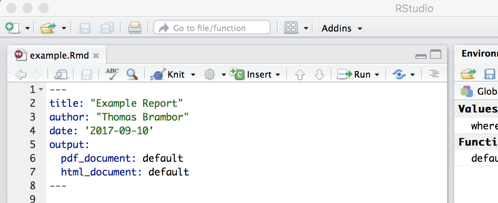
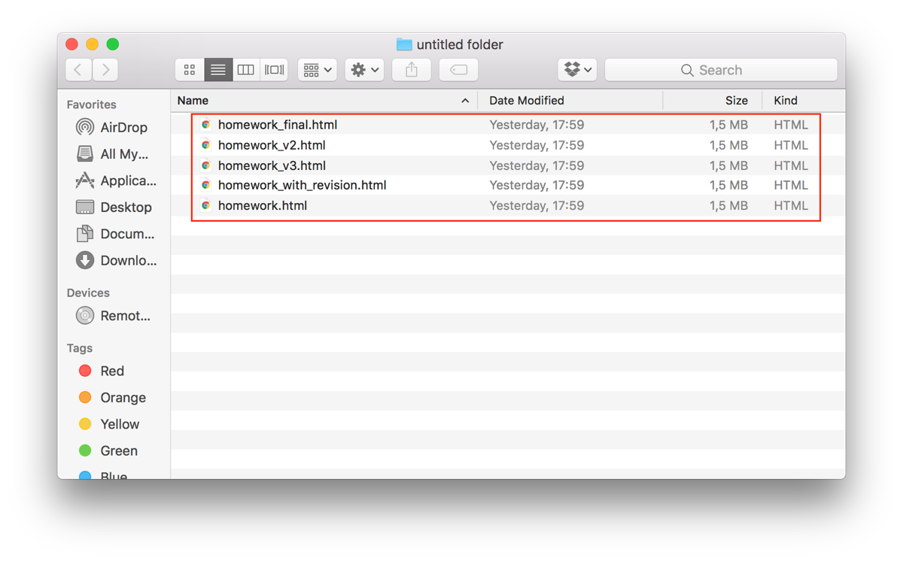
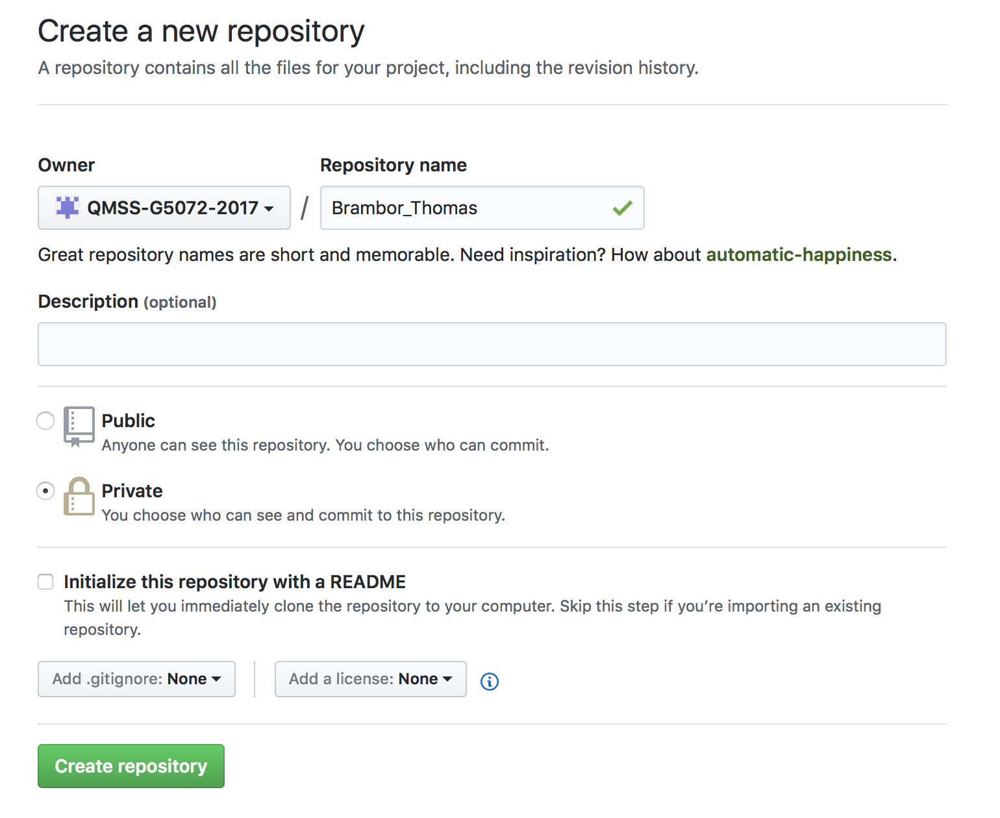
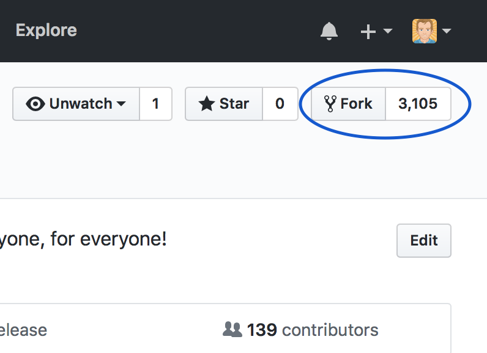
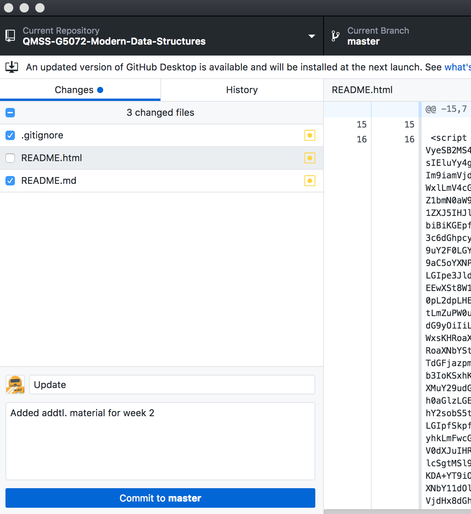
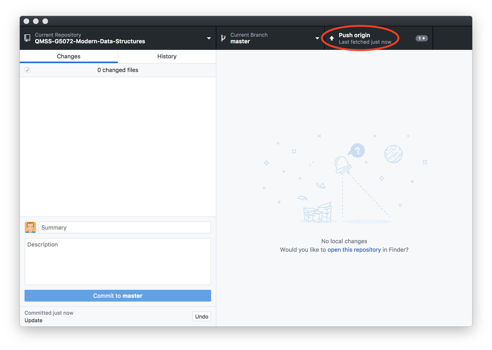
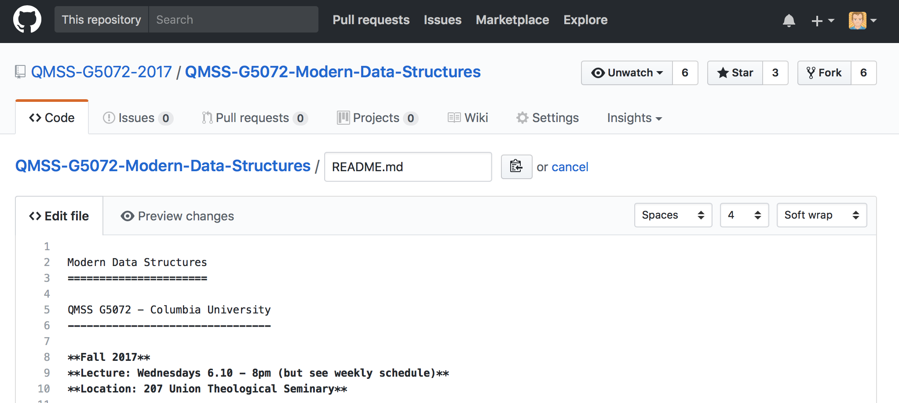
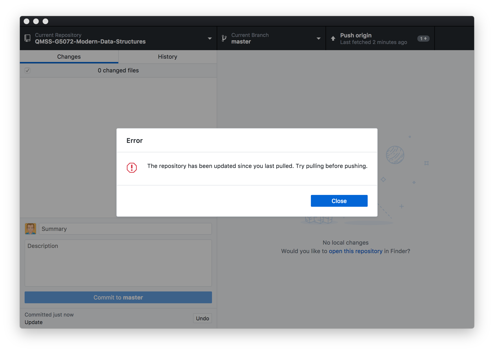

```{r packages, message = FALSE, warning = FALSE, echo=FALSE}
```


```{r Setup, include=FALSE, results='hide', warning=FALSE}
library(knitr)

opts_chunk$set(fig.path="images/",
               cache.path="cache/",
               cache=FALSE,
               echo=TRUE,
               message=FALSE,
               warning=FALSE)
```

## Roadmap

- How to use R Markdown? Tutorial with example document.
- How to use Git and Github for version control?

# Administrative

## New Students - Welcome!

```{r, echo=FALSE, out.width = "70%"}
knitr::include_graphics("images/data_analysis_excel.jpg")
```

## Waitlist

- A few students were added from the waitlist. 
- Waitlist is now closed and further is no longer active for Fall 2018 term.
- Unlikely to be added after this week. 

## Github usernames

Please go to this link *NOW* (if you have not already) and submit you Github username:

http://bit.ly/githubmds

## Office Hours set

Office hours of TAs now set as well.  

Instructor: Thomas Brambor  
[thomas.brambor@columbia.edu](thomas.brambor@columbia.edu)  
IAB 509E Mon 4.50 - 5.50pm  

TA1: Crystal Ni  
[xn2115@tc.columbia.edu](xn2115@tc.columbia.edu)  
IAB 270J Thur 10am - 12pm

TA2: Mikaela Zhang  
[xz2782@columbia.edu](xz2782@columbia.edu)  
IAB 270J Tue 10am - 12pm

## Advanced Material

- To allow advanced students or students with interest in specific topics to go a bit further than what is covered in the course, I am including a section called _Advanced Topics (optional, on your own only)_ on the syllabus for each week.  
- **Feel free to completely ignore these sections!**  
- These sections are meant to be autodidactive. The TAs and myself are first and foremost concerned with the material covered in the course.

```{r, echo=FALSE, out.width = "50%"}
knitr::include_graphics("images/Citadel-Library.png")
```

## Types of course registration

- **For credit, graded**: Required to hand in all exercises and complete the final project/exam.

- **Pass-Fail**: Same process as graded students. I submit a letter grade which the registrar converts to either P or F. 

- **R registered students (audit)**:
     - Complete 2 of the assignments from week 3 or later.  
     - No need to complete final project.

# R Studio and R Markdown

## Using R in RStudio   |  Typical new R user

```{r, echo=FALSE, out.width = "100%"}
knitr::include_graphics("images/rlevel-1.png")
```

<span style="font-size: 50%">Source: R Studio Webinar ["Introducing Notebooks with R Markdown"](https://www.rstudio.com/resources/webinars/introducing-notebooks-with-r-markdown/)</span>

## Using R in RStudio   |  Literate R programming with R Markdown

```{r, echo=FALSE, out.width = "100%"}
knitr::include_graphics("images/rlevel-3.png")
```

<span style="font-size: 50%">Source: R Studio Webinar ["Introducing Notebooks with R Markdown"](https://www.rstudio.com/resources/webinars/introducing-notebooks-with-r-markdown/)</span>


## Using R in RStudio   |  R Notebooks

```{r, echo=FALSE, out.width = "47%"}
knitr::include_graphics("images/rlevel-4.png")
```

<span style="font-size: 50%">Source: R Studio Webinar ["Introducing Notebooks with R Markdown"](https://www.rstudio.com/resources/webinars/introducing-notebooks-with-r-markdown/)</span>

# R Markdown

## R Markdown

- I asked everyone to familiarize themselves with R Markdown.
- Success?

## R Markdown Cheat Sheet

- Use the R Markdown [cheat sheet](https://www.rstudio.com/wp-content/uploads/2016/03/rmarkdown-cheatsheet-2.0.pdf) for a nice overview on Markdown in RStudio.

```{r, echo=FALSE, out.width = "45%"}
knitr::include_graphics("images/rmarkdown-cheatsheet-2.0_p1.png")
```
```{r, echo=FALSE, out.width = "45%"}
knitr::include_graphics("images/rmarkdown-cheatsheet-2.0_p2.png")
```

## Reporting in R Markdown

- Try yourself:
  - **File -> New File -> R Markdown -> Document -> HTML**
- Set output to different file formats (with the _Knit_ button)

## What is Markdown?

```{r, echo=FALSE, out.width = "100%"}
knitr::include_graphics("images/markdown_what_is1.png")
```

## What is Markdown?

```{r, echo=FALSE, out.width = "100%"}
knitr::include_graphics("images/markdown_what_is2.png")
```

## Markdown Syntax

- Need to learn a bit of markdown syntax 
- Take a look a the [cheat sheet](https://www.rstudio.com/wp-content/uploads/2016/03/rmarkdown-cheatsheet-2.0.pdf) and/or [reference guide](http://www.rstudio.com/wp-content/uploads/2015/03/rmarkdown-reference.pdf)

## Simple Formatting and Links

You can use Markdown to embed formatting instructions into your text. For example, you can make a word _italicized_ by surrounding it in asterisks, **bold** by surrounding it in two asterisks, and `monospaced` (like code) by surrounding it in backticks:

\**italics*\*, \*\***bold**\*\*, `` `code` ``
 
You can turn a word into a [link](www.google.com) by surrounding it in hard brackets and then placing the link behind it in parentheses, like this:

[Columbia U\](www.columbia\.edu)

## Headers

To create titles and headers, use leading hastags. The number of hashtags determines the header's level:

\# First level header  
\#\# Second level header  
\#\#\# Third level header  

## Lists

To make a bulleted list in Markdown, place each item on a new line after an asterisk and a space, like this:

\* item 1  
\* item 2  
\* item 3

You can make an ordered list by placing each item on a new line after a number followed by a period followed by a space.

1\. item 1  
2\. item 2  
3\. item 3

## Embedding equations

You can also use the Markdown syntax to embed latex math equations into your reports. To embed an equation in its own centered equation block, surround the equation with two pairs of dollar signs like this,

`$$1 + 1 = 2$$`

To embed an equation inline, surround it with a single pair of dollar signs, like this: `$1 + 1 = 2$`

All [standard Latex symbols](https://en.wikibooks.org/wiki/LaTeX/Mathematics) work.

## Knitr

[knitr](https://yihui.name/knitr/) is an engine for dynamic report generation with R and is used to convert (or "knit") R Markdown files into the desired output format.

```{r, echo=FALSE, out.width = "30%"}
knitr::include_graphics("images/knitr.png")
```

## Including R code inline and in chunks

- R code can be included as chunk with 

    \`\`\`{r} \`\`\`  
  
  or inline with a single tickmark.

- R functions sometimes return messages, warnings, and even error messages. By default, R Markdown will include these messages in your report. You can use the `message`, `warning` and `error` options to prevent R Markdown from displaying these.

## Popular chunk options

Three of the most popular chunk options are `echo`, `eval` and `results`.

- If `echo = FALSE`, R Markdown will not display the code in the final document (but it will still run the code and display its results unless told otherwise).

- If `eval = FALSE`, R Markdown will not run the code or include its results, (but it will still display the code unless told otherwise).

- If `results = 'hide'`, R Markdown will not display the results of the code (but it will still run the code and display the code itself unless told otherwise).

## Pandoc

- The Pandoc program (by John MacFarlane) renders R Markdown documents into the output we want.
- We can include specific options into the **YAML** header on top of our document to control this process. 

```{r, echo=FALSE, out.width = "80%"}

```

## R Notebooks

**Switch to the demo file `Rmarkdown_demo.Rmd` in the exercise folder for this week.**

## R Notebooks

1. Interact with R in a single, seamless stream.
2. Iterate quickly on code and output; see code and output together.
3. Leave a clean, reproducible record of your analysis in a simple text file.  
4. Document your analysis with rich, literate prose.
5. Share and publish easily.
6. One-click export to PDF, Word, etc.

<br><br><br><br><br>
<span style="font-size: 50%">Source: R Studio Webinar ["Introducing Notebooks with R Markdown"](https://www.rstudio.com/resources/webinars/introducing-notebooks-with-r-markdown/)</span>

## Other Output Formats

- html_document
- pdf_document
- word_document
- beamer_presentation / slidy_presentation / ioslides_presentation
- github_document

Note: see also description in exercise document.


# Version Control with Git and Github

## Why version control?

```{r, echo=FALSE, out.width = "100%"}

```

## Why version control?

- Confusing
- Prone to errors
- Collaboration
- Describe the changes
- Feature development

## Why Git?

* Git
    - master-branch workflow
    - distributed (rather than centralized) version control
    - pull requests to manage/discuss updates
    - de facto standard on version control

* GitHub
    - Github is like facebook for programmers. Everyone’s on there. 
    - open source
    - lowers the barriers to collaboration

## Resources to get started with Git and GitHub{.smaller}

* Git
    - [Official git command line and GUI clients, official documentation](https://git-scm.com/)
* Clients
    - [Desktop Client for Mac and Windows](https://desktop.github.com/)
    - [Sourcetree - another free visual Git](https://www.sourcetreeapp.com/)
* Tutorials
    - [Setting up git](https://help.github.com/articles/set-up-git/)
    - [Try.github](https://try.github.io)
    - [Hello World - GitHub for the non-programming beginner.](https://guides.github.com/activities/hello-world/)
    - [Guides at GitHub](https://guides.github.com/)
    - [Pro Git - a full book with lots of details](https://git-scm.com/book/en/v2)

## Intro Git - version control {.smaller}

* **Version control** 
    - VC is a great way to keep track of changes in code, manuscripts, presentations, and data analysis projects.
    - Allows you to save and annotate all changes to your code and files.
    - No need to rename files as "analysis_v1.R",  "analysis_with second graph.R",  "analysis_Mike update.R"
    
```{r, echo=FALSE, out.width = "60%"}
knitr::include_graphics("images/version-control.png")
```

## Intro Git - Local vs. Shared Repository

```{r, echo=FALSE, out.width = "35%"}
knitr::include_graphics("images/git_four_stages.png")
```

## Intro Git - Master-Branch

```{r, echo=FALSE, out.width = "50%"}
knitr::include_graphics("images/git_master_branch.png")
```

## Intro Git - Centralized vs. Distributed Version Control

```{r, echo=FALSE, out.width = "100%"}
knitr::include_graphics("images/git_dvn_cvn.png")
```

## Intro Git - Popularity

```{r, echo=FALSE, out.width = "100%"}
knitr::include_graphics("images/git_popularity.png")
```

<small><small>[Google Trends Comparison](https://www.google.com/trends/explore?date=all&q=%2Fm%2F05vqwg,%2Fm%2F012ct9,%2Fm%2F08441_,%2Fm%2F08w6d6,%2Fm%2F09d6g&hl=en-US)
</small></small>

## Intro GitHub

* single largest host for Git repositories, and is the central point of collaboration for millions of developers and projects
* Free. Allows easy open source hosting. Private repositories available with your .edu email address.
* While Git is a command line tool, GitHub provides a web-based graphical interface.
* Provides access control and several collaboration features, such as a wikis and basic task management tools for every project.

## Why / For what should you use GitHub?

- Use GitHub for your **homework exercises**
- Get the **class material and resources** on GitHub. 
- Find useful repositories, packages, data, code, and tutorials: e.g. [tidyverse](https://github.com/tidyverse), Hadley Wickham's ["Advanced R" book](https://github.com/hadley/adv-r) etc.

# Tutorial - How to use Github

## Creating a new repository

```{r, echo=FALSE, out.width = "80%"}

```

## Cloning a repository

- A clone is a copy of a repository that lives on your computer instead of on a website's server somewhere, or the act of making that copy

```{r, echo=FALSE, out.width = "90%"}
knitr::include_graphics("images/github_step2_clone.png")
```

## Forking a repository

- A fork is a copy of another user's repository that you manage (and lives on your account). 

- Forks let you make changes to a project without affecting the original repository.

- You can fetch updates from or submit changes to the original repository with pull requests.

```{r, echo=FALSE, out.width = "90%"}

```

## Forking the course repository

- Go to: https://github.com/QMSS-G5072-2018/QMSS-G5072-Modern-Data-Structures
- Fork the course repository
- Fetch changes through Github Desktop.

## Commit to Master {.smaller}

- A commit, or "revision", is an individual change to a file (or set of files)
- It's like when you _save_ a file, except every time you save it creates a unique ID. A commit also contains a description of _what has changed_. 

```{r, echo=FALSE, out.width = "50%"}

```

## Upload to Remote (Push)

- Pushing refers to sending your committed changes to a remote repository such as GitHub.com

```{r, echo=FALSE, out.width = "90%"}

```

## Changing files online

- You can change files directly through the github.com website. Click the edit button, change, and the commit.

```{r, echo=FALSE, out.width = "100%"}

```

## Changing files online

```{r, echo=FALSE, out.width = "100%"}

```

# Github - Branching (optional for this course)

## Github Flow - Create a branch

```{r, echo=FALSE, out.width = "80%"}
knitr::include_graphics("images/gihub_flow_branch.png")
```

- Try out ideas for your project by creating a branch.
- Changes you make on a branch don't affect the master branch, so you're free to experiment and commit changes.

## Github Flow - Add commits

```{r, echo=FALSE, out.width = "80%"}
knitr::include_graphics("images/gihub_flow_commits.png")
```

- Whenever you add, edit, or delete a file, you're making a commit, and adding them to your branch. 
- Keeps track of your progress as you work on a branch.
- Transparent history of your work with associated commit message (i.e a description of your change).
- Allows you to roll back if things go awry. 

## Github Flow - Pull Request

```{r, echo=FALSE, out.width = "80%"}
knitr::include_graphics("images/gihub_flow_pullrequest.png")
```

- Pull Requests initiate discussion about your commits. 
- Anyone can see exactly what changes would be merged if they accept your request.
- Using GitHub's @mention system in your Pull Request message to ask for feedback from your team.

## Github Flow - Discuss and Review

```{r, echo=FALSE, out.width = "80%"}
knitr::include_graphics("images/gihub_flow_discuss.png")
```

- Discuss and review the changes. 
- Continue to fix code and push up the change with new commits.
- GitHub will show your new commits and any additional feedback you may receive in the unified Pull Request view.

## Github Flow - Deploy

```{r, echo=FALSE, out.width = "80%"}
knitr::include_graphics("images/gihub_flow_deploy.png")
```

- Check your branch to verify it works.
- If your branch causes issues, you can roll it back by deploying the existing master again.

## Github Flow - Merge

```{r, echo=FALSE, out.width = "80%"}
knitr::include_graphics("images/gihub_flow_merge.png")
```

- Merge your code into the master branch.
- Pull Requests preserve a record of the historical changes to your code. Because they're searchable, they let anyone go back in time to understand why and how a decision was made.
